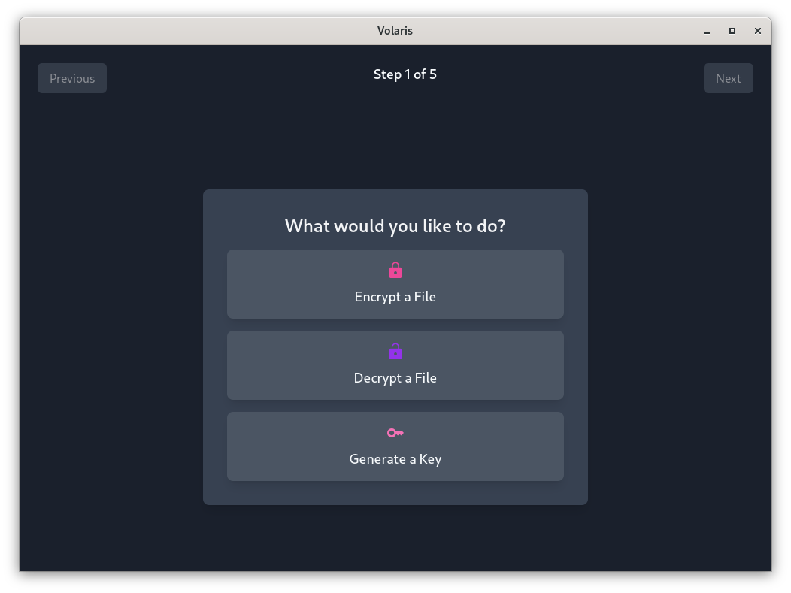

# Volaris GUI

Volaris GUI is a sleek and modern Svelte/Tauri-based app designed to streamline the process of file encryption and decryption using key files.

Volaris GUI is a sub-project of [Volaris](https://github.com/volar-is/volaris). Find out more info about Volaris and its encryption methods there.

RPM BUILDS DO NOT WORK.

## Features

- **File Encryption & Decryption**: Easily encrypt or decrypt files with just a few clicks.
- **Key File Management**: Create new key files or select existing ones directly from the app.
- **Modern UI**: A clean and responsive design using Svelte and Tailwind CSS.

## Screenshots

More in [here.](./screenshots)

## Getting Started

### Prerequisites

To run the project, you'll need to have the following installed:

- [Node.js](https://nodejs.org/) (v18.x or later *should* work)
- [pnpm](https://pnpm.io)
- [Tauri](https://tauri.app/)

### Installation

1. **Clone the repository**:

   `git clone https://github.com/volar-is/volaris-gui.git`
   `cd volaris-gui`

2. **Install dependencies**:

   `pnpm install`

3. **Run the application**:

   - **Development Mode**:

     `pnpm tauri dev`

   - **Build for Production**:

     `pnpm tauri build`

### Usage

Pretty self explanatory. Outdated info was here.

### Contributing

To contribute:

1. Fork the repository.
2. Create a new branch:
   `git checkout -b feature/YourFeature`
3. Make your changes and commit them:
   `git commit -m "feat: Add your feature"`
4. Push to the branch:
   `git push origin feature/YourFeature`
5. Open a pull request.

**Note:** This repository uses conventional commits. Please follow the [conventional commits guidelines](https://www.conventionalcommits.org/en/v1.0.0/) for your commit messages.

### License
This project is licensed under the BSD 2-Clause License License. See the [LICENSE](/LICENSE) file for details.

